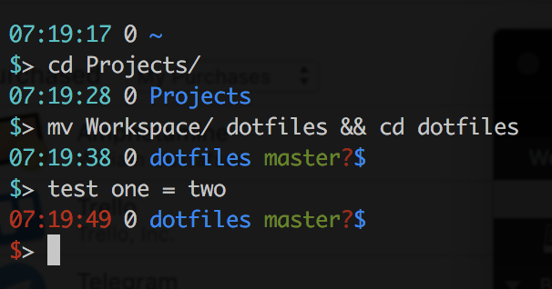

# Dotiles by [samba][1]

Probably you should check out the [README][1] if you care for much detail.

**_Caution_** this will overwrite any existing `bash`, `vim`, and other configuration that you have, in various places, e.g. `.bashrc`. 

To bootstrap a new machine with this configuration:

```shell
which apt-get && apt-get install git-core make python python2.7 ;
git clone https://github.com/samba/dotfiles.git && cd dotfiles && make dotfiles
```

**On a Mac** you will need to install XCode first.

## Additional usage 

Possibly you may want one of these two modes:

```shell
make dotfiles  # installs just the dotfiles
make apps      # installs just the apps
```

For more options, try `make help`.


## Settings Applied by these Dotfiles

- A simple, colorful, and semantically expressive prompt
- Lots of shell aliases, adding desired features (e.g. colored diff)
- Some handy shortcuts functions, e.g. `http`, `calc`
- Automatic handling of `ssh-agent`
- Automatic inclusion of various `PATH` extensions and auto-completion
- A `screen` config that leverages built-in features for usable experience
- Suitable integration between these above (particularly `bash`, `vim`, and `screen`)
- Automatic generation of an SSH key if needed
- Some `.ssh/config` for compression and socket multiplexing
- Some `git` aliases
- A Python `usercustomize.py` with a colored prompt
- Lots of tweaks for macOS user experience

*Note*: a variety of macOS settings are automatically tuned during the `apps` phase. 
This process will terminate any running Chrome, Safari, and various other apps, due to actively changing settings. Unless the preferences file gets changed, this should only happen once.


### Prompt Format

The command prompt this installs displays several components:

- Timestamp _colored by last command exit code_
- Background jobs
- Working directory basename
- Git status (if present)
- Kubernetes cluster context (if present)
- Short prompt on separate line, _colored by last command exit code_

Screenshot:


### Vim configuration

Several important features for my workflow

- Minimal use of third party plugins, but automatically installed where needed
- Lots of filetype autodetection
- Sensible tab/space controls
- Line numbers
- Code folding
- A sensible netrw configuration for project/dir navigation
- Autocompletion via `ctrl-X` omnifunc menu
- Autocompletion toggled via `\C`
- Buffer navigation shorthand (`\n`, `\p`)
- Tab navigation: (`\tn`, `\tp`, `\tex`)
- Comment flipping: `\/`
- Makefile calls: `\m`
- Various other shorthands...


## More Apps from the AppStore

Additional tools I find useful...

- Xcode  (*Note* this is probably required _first_ before this `Makefile` will work.)
- Postico
- Slack
- Evernote
- Skitch
- Pocket
- Kindle
- Pixelmator
- The Unarchiver
- Emphetamine
- Cinch
- Trello
- MindNode 5
- LastPass

[1]: https://github.com/samba/dotfiles
[2]: https://desktop.github.com/
[3]: https://www.google.com/chrome/browser/desktop/
[4]: https://kapeli.com/dash
[10]: https://github.com/settings/keys
